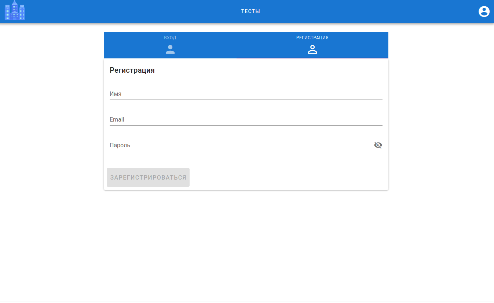
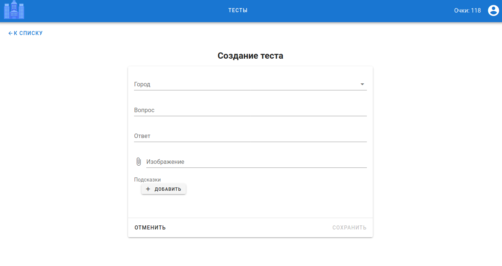
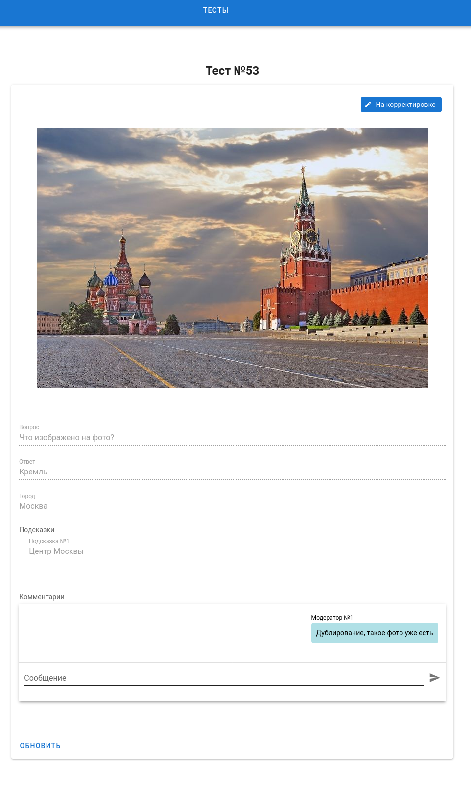

# City expert frontend

### About
Frontend for [city-expert-backend](https://github.com/log95/city-expert-backend).

Based on [Vue.js](https://vuejs.org/).

### Start app
- Need `docker`, `docker-compose` installed
- Clone repository. `git clone https://github.com/log95/city-expert-frontend.git`
- Up environment. `docker-compose up -d`
- Site available on `http://localhost:8081/`

### Login
- Test user: `user@test.ru`, `123456789`
- Test moderator: `moderator@test.ru`, `123456789`

### Screens
- Register / Login  

- Test list  

- Not answered test  

- Answered test  

- Test creation  

- Denied test by moderator  

